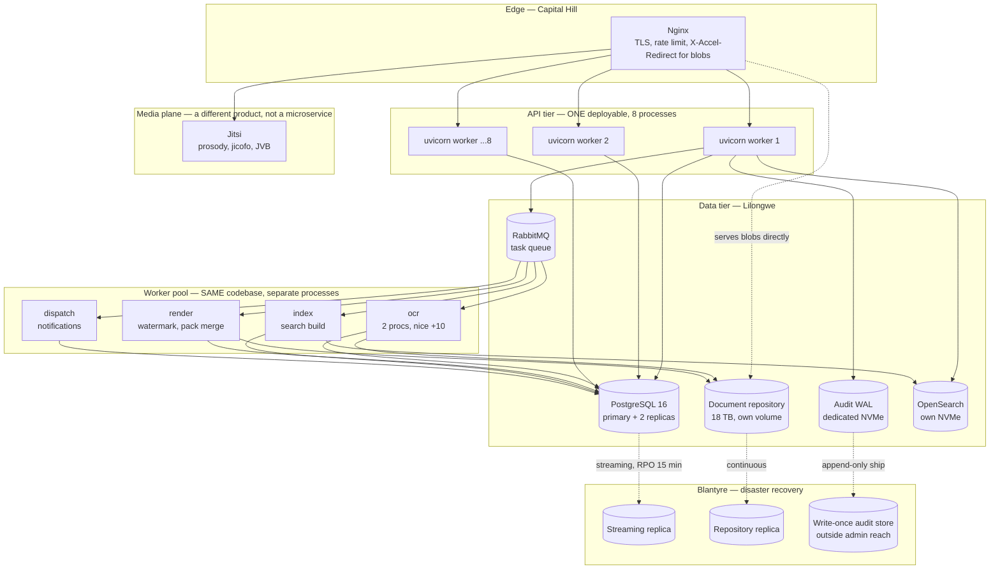
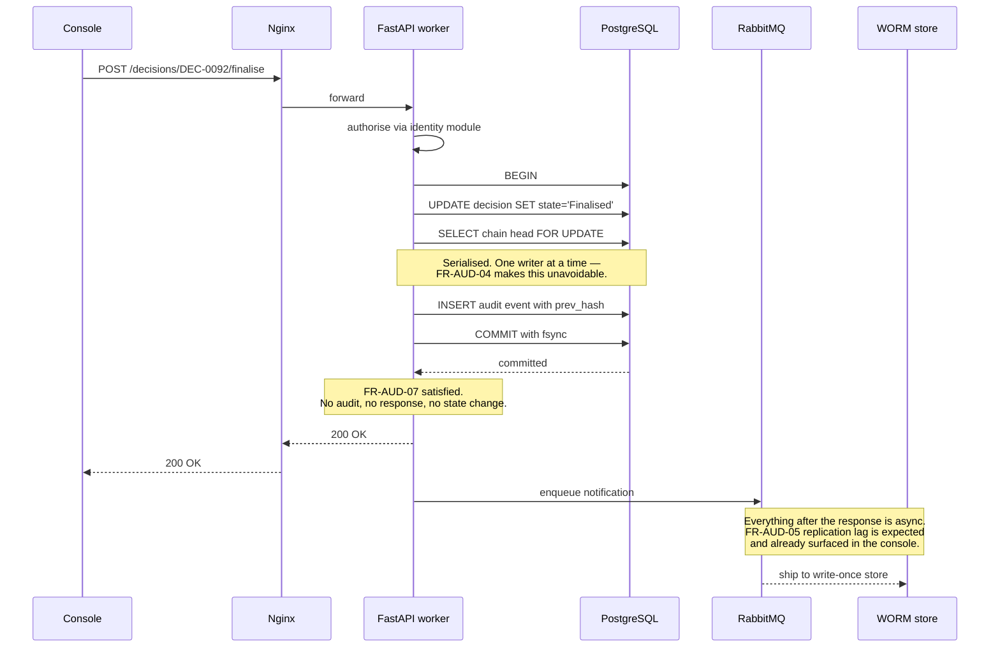

# Backend architecture: monolith or microservices

**Recommendation: a modular monolith, plus a worker pool for CPU-bound work, plus the media plane which is separate by nature.** One deployable for the API, one codebase, several process types.

This is not the cautious answer. It is the answer the requirements force, and the reasoning below is meant to be checkable rather than taken on trust. The section on [what would change this](#what-would-change-this) is the honest part — read it before treating the decision as settled.

---

## 1. What this system actually is

Architecture follows from load and from operating constraints, so the numbers come first. These are drawn from the console's own registers.

| Dimension | Reality | What it implies |
|---|---|---|
| Named users | ~1,000–2,000 across roughly 20 ministries | Small |
| Peak concurrency | ~30–50, during a Cabinet sitting | Very small |
| Write rate at peak | tens per second, not thousands | Very small |
| Document corpus | ~18 TB of 30 TB, growing | **Large** |
| Search corpus | ~1,400 records, ~1.5 M full-text terms | Small |
| Deployment | Lilongwe production, Blantyre DR, on-premises | No managed control plane |
| Cloud services | None permitted — FR-DAT-06 | No managed queues, no serverless |
| Technical staff | 2–3, of whom one is the platform administrator | **No platform team** |
| RTO / RPO | 4 hours / 15 minutes — FR-DAT-11 | Recovery must be doable by a person at 02:00 |
| Non-production | Configured *identically* to production — FR-ADM-07 | Parity must be achievable |

The shape is unusual and worth naming: **this is a low-traffic, high-byte, low-headcount, air-gapped-by-policy system.** Microservices are a scaling and team-autonomy pattern. Neither of those is the constraint here. Disk throughput and operational simplicity are.

A single 8-core server with fast NVMe handles this request volume with roughly two orders of magnitude of headroom. The engineering problem is not "how do we serve 50 concurrent users" — it is "how do we watermark a 90-page SECRET paper per recipient, OCR a 118-page scanned annexe, and keep an unbroken hash chain, without any of that blocking a Minister opening a pack."

That problem is solved by **process separation**, not by **service decomposition**. Those are different things and conflating them is the most common way this decision goes wrong.

---

## 2. The four factors

### 2.1 Threading

FastAPI on an ASGI server has three execution contexts, and picking the wrong one is the single most common FastAPI performance bug.

| You write | It runs | Concurrency limit | Safe for |
|---|---|---|---|
| `async def` endpoint | On the event loop, in the worker process | Thousands of in-flight awaits | Non-blocking I/O only |
| `def` endpoint | In AnyIO's thread pool (40 threads by default) | 40 concurrent, then queues | Short blocking calls |
| Anything CPU-bound | Wherever you put it — and it **holds the GIL** | 1 core, and it stalls everything sharing the process | Nothing in the request path |

Three rules follow.

**A blocking call inside `async def` stalls the whole worker.** Not the request — the worker, and every other request it is serving. `requests.get()`, `time.sleep()`, `open().read()` on a large file, a synchronous DB driver: any of these inside `async def` freezes the event loop. Use `asyncpg` or SQLAlchemy's async engine, `httpx.AsyncClient`, and `anyio.to_thread.run_sync()` for the odd unavoidable blocking library.

**Threads do not give you CPU parallelism.** CPython's GIL means only one thread executes Python bytecode at a time. Forty threads OCR-ing PDFs are forty threads taking turns. Python 3.13's free-threaded build changes this, but it is experimental and much of the C-extension ecosystem — including some PDF and image libraries — is not ready. Do not plan on it.

**CPU parallelism comes from processes.** Run `gunicorn` with `uvicorn` workers, one worker per core:

```
gunicorn app.main:app \
  --worker-class uvicorn.workers.UvicornWorker \
  --workers 8 \
  --graceful-timeout 30
```

Note what this already gives you: eight isolated OS processes, independently restartable, each crash-contained. That is most of the fault isolation people reach for microservices to obtain — from one deployable.

**Where microservices are neutral.** Splitting into twelve services does not raise the GIL or add cores. Twelve services on one box contend for the same eight cores, and now with network hops between them. Threading is a *process-model* question, and the process model is orthogonal to the service count.

### 2.2 CPU overloading

The genuinely CPU-bound work in this system:

| Work | Requirement | Cost | Bound by |
|---|---|---|---|
| Per-recipient PDF watermarking | FR-DOC | seconds per document per recipient | CPU + disk |
| OCR of scanned annexes | FR-SCH-09 | minutes per document — the seed data has a 118-page study | CPU, heavily |
| Pack assembly and merge | FR-PCK | seconds to minutes | Disk, then CPU |
| Search index build | FR-SCH-04 | minutes, bursty | CPU + disk |
| Audit hash chaining | FR-AUD-04 | microseconds per event | Negligible CPU, but **serialised** |

A 30-person pack release means up to 30 watermarking jobs. On eight cores, in the request path, that is a stalled console. It must not be in the request path — and that has nothing to do with how many services there are.

**The answer either way is a task queue.** The API accepts the request, records intent, enqueues, returns. Separate worker processes consume the queue. Use Celery, Dramatiq, or arq with Redis or RabbitMQ — on-premises, since FR-DAT-06 rules out managed queues.

The critical point: **a monolith with a worker pool gives exactly the same CPU isolation as microservices.** Same process boundaries, same crash containment, same ability to give OCR its own cores or its own machine. What it does not give you is twelve deployment pipelines, twelve config files, and twelve things to bring up in order at 02:00.

"We need microservices so heavy work does not block the API" is a false argument. You need *worker processes*. You already need those inside a monolith.

### 2.3 Network requests

This is where microservices actively lose, and where a specific requirement decides it.

**FR-AUD-07:** *An audit event shall be written before the response to a state-changing request is returned. A failure to write audit shall fail the operation.*

Read that as an engineer. Every write in the system needs the business change and the audit record to succeed or fail together. In a monolith that is one database transaction:

```python
async with session.begin():
    decision = await decisions.finalise(decision_id, actor)
    await audit.append(action="Decision finalised", target=decision.id, actor=actor)
    # One commit. Both, or neither.
```

Split audit into its own service and the same guarantee needs a distributed transaction — two-phase commit, or a saga with compensating actions, over the network, on every single write. You would take the strongest control in the system and make it the most fragile part of it. For a system whose entire value rests on the audit trail being trustworthy, that is the wrong trade at any scale, and at *this* scale there is no compensating benefit at all.

**FR-AUD-04** compounds it. A hash chain is sequential by construction: entry N hashes entry N−1. Appending requires the current chain head. That is a **single-writer constraint you cannot shard**. It is naturally satisfied by one transaction against one table; it is fought by every distributed design.

**FR-SCH-02** adds a second: *Search shall return only material the requesting user is authorised to see. Results shall not reveal the existence, title, count or metadata of unauthorised documents.* Entitlement is identity's business; documents are the repository's. Split them and every query fans out and re-joins across the network — and the filter has to run **before** counting, so it cannot be a cheap post-filter.

The arithmetic:

| Call | Latency |
|---|---|
| In-process function call | ~100 ns |
| Same-datacentre HTTP round trip | ~0.5–2 ms |

Roughly ten thousand times slower. Fine once. Not fine when FR-SCH-08 puts a response-time threshold on search and every request crosses three or four services, each contributing its own tail. Tail latency compounds: four services at p99 = 50 ms give you a p99 well above 50 ms, because you wait for the slowest of four independent draws.

And every hop is a new failure mode. Twelve services have far more than twelve ways to fail — they have the partial failures between them, which are the ones that corrupt state and are hardest to test.

### 2.4 Disk I/O

This is the real bottleneck, and the factor most often ignored.

**Microservices do not give you more disk.** If the document repository is one volume, splitting the code that reads it does not split the I/O. Eighteen terabytes behind twelve services is eighteen terabytes behind one filesystem, now with more processes queuing on the same device.

What actually helps, and applies to either architecture:

**Separate the volumes by access pattern.** These four have nothing in common and should not share a device:

| Volume | Pattern | Wants |
|---|---|---|
| Audit WAL | Small sequential appends, **fsync in the request path** | Lowest-latency device you have. Its own NVMe. |
| OLTP database | Small random reads/writes | Fast NVMe |
| Document repository | Large sequential reads, occasional large writes | Throughput, capacity |
| Search index | Random reads, bursty large writes during rebuild | Fast NVMe, isolated from the repository |

The audit device deserves emphasis. FR-AUD-07 puts a durable write in the critical path of **every state-changing request**. That is one fsync per write, serialised by the chain. If it shares a spindle with an OCR job writing a 400 MB output file, every Minister's click waits behind that OCR write. Give it its own device.

**Stream, never buffer.** A 90-page paper read into memory to be watermarked is ~50 MB per concurrent request. Thirty of those is 1.5 GB and an OOM kill. Stream with `StreamingResponse`, and use the kernel's `sendfile` path where you can serve bytes untouched.

**Never let a document leave through the API process.** Have the reverse proxy serve blobs by internal redirect — Nginx `X-Accel-Redirect`, or its equivalent — after FastAPI authorises the request. FastAPI decides *whether*; Nginx moves the bytes. This keeps 50 MB transfers out of Python entirely, which matters more than any other single optimisation here.

**Watch the write amplification.** A pack released to 30 recipients with per-recipient watermarks is 30 derived copies. At ~50 MB each that is 1.5 GB per release. This is why the corpus is 18 TB with only a few hundred papers, and it is a disk-planning question, not an architecture one.

---

## 3. The recommended shape



Four process types. **One codebase, one deployable artefact, one migration history, one CI pipeline.**

### Module boundaries

Draw them along the FR areas, enforce them in code, and do not let them become network calls until something forces it.

| Module | FR area | Notes |
|---|---|---|
| `identity` | FR-IAM | Everything else depends on it; it depends on nothing |
| `meetings` | FR-MTG | |
| `submissions` | FR-SUB | Two audiences, one module — the split is in authorisation, not code |
| `packs` | FR-PCK | Enqueues to `render` |
| `documents` | FR-DOC | Owns classification and handling rules |
| `review` | FR-REV | |
| `rooms` | FR-PRS | Talks to room devices |
| `video` | FR-VID | Thin: mints Jitsi tokens, records attendance. The media never touches Python |
| `decisions` | FR-DEC | |
| `search` | FR-SCH | Enqueues to `index`. Queries OpenSearch. **Entitlement filter lives here** |
| `notifications` | FR-NOT | Enqueues to `dispatch` |
| `audit` | FR-AUD | **Everything writes through it. It imports nothing.** |
| `admin` | FR-ADM | |
| `governance` | FR-DAT | Retention, holds, deletion, archival |

Two rules make this a *modular* monolith rather than a big ball of mud:

1. **`audit` is a leaf.** It imports no other module. Every other module imports it. Enforce with an import-linter rule in CI — this is a five-line config and it is the difference between a monolith you can reason about and one you cannot.
2. **Modules talk through their service layer, never each other's tables.** One schema per module in Postgres, and no cross-schema foreign keys except to `identity`. If you ever do need to extract a module, the seam is already there.

### The audit write path

This sequence is the reason for the whole recommendation.



Note the throughput ceiling this creates, and note that it does not matter. A serialised chain append with an fsync runs at roughly 1,000–5,000 per second on decent NVMe. Peak demand here is tens per second. Two to three orders of magnitude of headroom — and if that ever became the ceiling, the fix is epoch-batched Merkle chaining, not microservices.

### Threading rules, concretely

| Work | Where it goes | How |
|---|---|---|
| DB query | `async def` endpoint | `asyncpg` / SQLAlchemy async |
| External HTTP | `async def` endpoint | `httpx.AsyncClient` |
| Blob download to the user | **Not in Python** | Nginx `X-Accel-Redirect` after authorisation |
| Small blocking library call | `async def` | `await anyio.to_thread.run_sync(fn)` |
| Watermarking, OCR, pack merge, indexing | Worker pool | Enqueue, return `202`, notify on completion |
| Audit append | Inside the request transaction | Never deferred, never queued |

Connection-pool arithmetic that bites people: the pool is **per process**. Eight workers × pool size 10 = 80 connections, plus workers, plus replicas. Set `max_connections` accordingly, or put PgBouncer in front. Getting this wrong shows up as intermittent timeouts under load and is maddening to diagnose.

---

## 4. Why not microservices

Not "microservices are bad" — they are the right answer to problems this system does not have.

| Microservices give you | Do you need it? |
|---|---|
| Independent scaling per service | No. Peak is 50 users. Nothing needs scaling independently. |
| Team autonomy, independent deploys | No. Two or three engineers. Coordination cost is a conversation. |
| Polyglot freedom | No. It is FastAPI throughout, by decision. |
| Fault isolation | **Already have it** — eight worker processes plus a separate worker pool. |
| Independent failure domains | Partly. But it also *creates* partial-failure modes that break FR-AUD-07. |

And they charge for it:

- **Distributed transactions across the audit boundary.** FR-AUD-07 becomes a saga. This alone should end the discussion.
- **Operational surface you have no staff for.** Service discovery, mTLS between services, distributed tracing, per-service pipelines and config. On-premises, with no managed control plane, with two or three technical staff. That is a platform team's workload.
- **FR-DAT-11's four-hour RTO.** Recovering one deployable, one database and one blob store is a runbook a person can follow under pressure. Recovering twelve services with an interdependent startup order, at 02:00, is how a four-hour RTO becomes a twelve-hour outage.
- **FR-ADM-07's parity requirement.** Non-production must be configured *identically* to production. Parity of one deployable is verifiable — the console already shows it line by line. Parity of twelve services and their inter-service config is where "identically" quietly stops being true.
- **FR-AUD-13-style separation of duties gets harder,** not easier, when the identity of a caller has to be propagated correctly across every hop.

---

## 5. The honest costs of the recommendation

A modular monolith is not free, and pretending otherwise would make this document useless.

| Cost | Severity | Mitigation |
|---|---|---|
| One deploy restarts the whole API | Low | Rolling restart behind Nginx with graceful drain. Eight workers means never all at once. |
| A memory leak in one module affects the process | Low | Multiple worker processes; supervisor with `max_requests` recycling. |
| Module boundaries erode without discipline | **Real** | Import-linter in CI, schema-per-module, `audit` as a leaf. Automate it or it will not happen. |
| One big test suite gets slow | Medium | Parallelise by module; module-scoped fixtures. |
| Cannot scale one hot path independently | Low, and hypothetical at this scale | The worker pool already absorbs the heavy paths. |
| Migrations touch one shared history | Medium | Schema-per-module keeps them independent in practice. |

The one that actually bites is boundary erosion. It is also the one that is cheapest to prevent, and the prevention has to be mechanical rather than cultural.

---

## 6. What would change this

Concrete triggers. If none of these is true, do not revisit the decision.

- **Concurrency above ~5,000 sustained.** Two orders of magnitude beyond today. Extract read-heavy paths first, and only those.
- **A module needing genuinely different hardware.** If OCR wants GPUs, it becomes a service. That is one extraction, not a rewrite — and the worker pool is already most of the way there.
- **A second tenant or a second country.** Multi-tenancy changes the shape of everything, including this.
- **More than about eight engineers on the backend.** Coordination cost starts to exceed the cost of network boundaries somewhere around there.
- **A statutory requirement to physically separate a subsystem.** If audit must run on separately-administered infrastructure — which FR-AUD-05 and FR-AUD-06 gesture at without requiring — that argues for extracting audit *storage*, not the audit *write path*. The append must stay in the transaction.

Note what is not on the list: "the codebase got big", "microservices are best practice", "we might need to scale one day". None of those is a reason.

---

## 7. If you take one thing

The question "monolith or microservices" is the wrong axis for this system. The right question is **which work runs in which process**, and it has a clear answer:

- Request handling → eight uvicorn workers, `async` throughout, no blocking calls
- Heavy CPU work → a worker pool, out of the request path, same codebase
- Bytes on disk → Nginx, never Python
- Audit → inside the request transaction, always, on its own device

That gives you the fault isolation, the CPU parallelism and the disk behaviour people usually go to microservices for, while keeping FR-AUD-07 as one `COMMIT` instead of a distributed transaction — and keeping a 02:00 recovery inside the four hours FR-DAT-11 allows.

Start here. Extract later, from a codebase whose seams you have already drawn.
